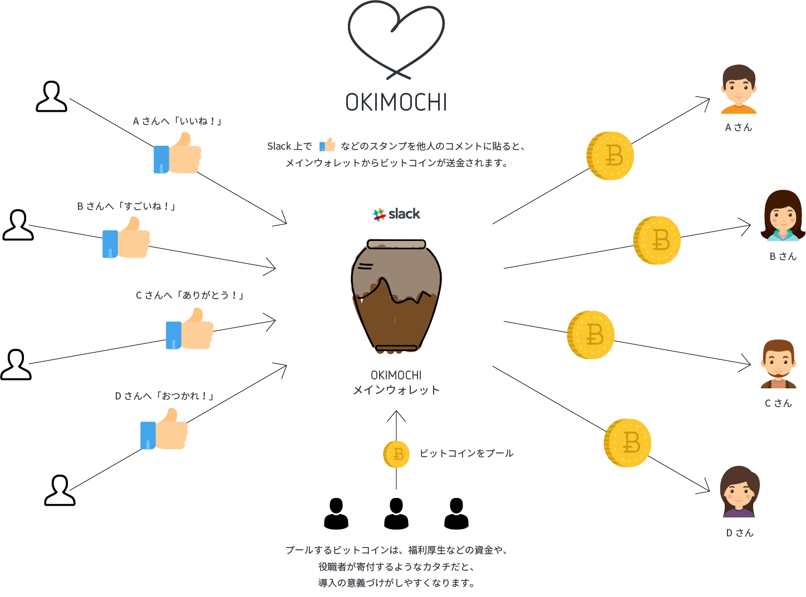

# OKIMOCHI (see [here](doc/english_readme.md) for English manual)
日頃の感謝の気持ちを、少額のビットコインという形にして、Slack上の従業員同士で送り合えるbotアプリケーション。

## OKIMOCHI開発の背景
事務所への配送業者の来訪に席の配置の関係で特定の社員が応対をする。給湯室の片付けを気付いた社員が行う。特別な事ではなく業務とも言えないけれど、従業員のささやかな善意や気遣いで企業や事務所の運営が成り立っているケースが多々あります。そのような善意へのありがとうという感謝の気持ちに加え、少額のビットコインの送付ができるSlackbotが「OKIMOCHI」です。

## 使い方イメージ



1. 送付の原資となるビットコインをメインウォレットに入金する（会社の福利厚生用の資金を纒めて入金するような形を想定しています）※ 原資となるビットコインは利用者の誰から入金されても同じウォレットに入金されます。
2. 送付のトリガーとなる指定のスタンプや指定コマンドを入力して送金する。
3. 一定のビットコインが貯まったら、指定した外部のビットコインウォレットへ引き出す。※その他の詳しい使い方はヘルプコマンドにて参照頂けます。  

### 利用上の注意事項
__このアプリケーションは各利用者の善意に基づいております。二人以上の利用者が結託した場合、メインウォレット内の資金を盗むことができます。（自分から自分に対する送金は不可だが、お互いに送金し合うことでメインウォレット内の資金を盗むことが可能）預け金の合計は小額にとどめ、信頼できる仲間内のチームで使用してください！__


## 導入方法
- Slack Appsの作成/Webhook URLを発行  
Slack AppsとWebhook URLを <a href="https://api.slack.com/app://api.slack.com/apps">slack API</a>にて作成  
Slack <a href="https://slack.com/apps/manage/A0F7YS25R-bots">Botの管理ページ</a> からAdd Configurationをクリックし、 `API Token` を発行します。  
`Client ID` `Client Secret` `Verification Token` `Webhook URL` `API Token` をメモ
- Protlyのアカウント作成・API keyの発行  
ビットコインの獲得ランキングなどを図化するための作図アプリ <a href="https://plot.ly">Plotly</a> のアカウントを作成し、API Keyを発行する。  
`API Key` `username` をメモ
- インフラ準備  
- Gitをinstallし、Repositoryをclone  
- 環境変数を更新  
`.env_example`をコピーし、環境変数を設定

```
cp .env_example .env # modify .env with your own slack bot token
```

| 変数名               | 内容                                                                                                               |
| :------------------- | :-------------------------------------------------------------------------                                         |
| SLACK_CLIENT_ID      | Slack `Client ID` を入力                                                                                           |
| SLACK_CLIENT_SECRET  | Slack `Client Secret` を入力                                                                                       |
| VERIFICATION_TOKEN   | Slack `Verification Token` を入力                                                                                  |
| EMOJI                | Slack Botのアイコンを設定                                                                                          |
| TOKEN                | Slack Botの`API Token` を入力                                                                                      |
| WEBHOOK_URL          | Slack `Webhook URL` を入力                                                                                         |
| DEFAULT_CHANNEL      | デフォルトのSlackチャンネルを入力                                                                                  |
| ADMIN_USERNAME       | 管理者となるSlack ユーザ名を入力                                                                                   |
| BITCOIND_HOST_DIR    | ブロックチェーンや秘密鍵などの格納先。デフォルトは `~/.bitcoin`                                                    |
| BITCOIND_URI         | 既にbitcoindサーバをお持ちの場合、URIを入力                                                                        |
| BITCOIND_USERNAME    | 既にbitcoindサーバをお持ちの場合、USERNAMEを入力。新規の場合、任意の文字列を入力(十分長くて推測できないものを推奨) |
| BITCOIND_PASSWORD    | 既にbitcoindサーバをお持ちの場合、PASSWORDを入力。新規の場合、任意の文字列を入力(十分長くて推測できないものを推奨) |
| BITCOIND_NETWORK     | 本番用の場合は `mainnet` 、試験用の場合は `testnet`                                                                |
| PLOTLY_API_KEY       | Plotlyの `API Key` を入力                                                                                          |
| PLOTLY_API_USER      | Plotlyの `username` を入力                                                                                         |
| MESSAGE_LANG         | 日本語と英語を用意。日本語は `ja` 、英語は `en`                                                                    |

- Docker環境の構築、dokcer-compose up（bitcoindの同期に約10時間程度必要）  
```
docker network create -d bridge --subnet 172.0.0.0/24 --gateway 172.0.0.1 okimochi-network
COMPOSE_HTTP_TIMEOUT=45000 docker-compose up —build
```
- 稼働確認  
```
# Slack チャンネルにて@okimochiを招待
/invite @okimochi
# 使い方をリクエスト
@okimochi help
```

## その他設定項目

### 反応する対象のボタンとその金額

`okimochi/locale/*.js` の `emoji_to_BTC_map` を編集してください。

### 最低トランザクション金額の設定

`okimochi/config.js` の `minimumTxAmount` を設定してください。

### `tip` 時の最大金額

`okimochi/config.js` の `MAX_TIP_AMOUNT ` を設定してください。

## ホストマシンの推奨スペック

* Memory ... 3GB
* Storage ... 160GB( `BITCOIND_HOST_DIR` で指定するブロックチェーンデータ容量) + 2GB (ユーザーデータベース)

## CAMPFIREでの試験導入結果
CAMPFIREでは社内における試験を実施し、1週間で約100件の「OKIMOCHI」が送られました。
試験概要は以下の通りです。  
- 試験期間 : 2017年7月25日 〜 2017年8月11日
- 参加従業員数 : 約40名
- tip数（トランザクション数）：200件
- 1度の送付金額(botの設定で可変) : 約30円
- ビットコインの原資 : 約60,000円

## 開発への参加方法
ソースコードのコメント、GitHub のイシューやプルリクエストでは、日本語か英語を使用して下さい。
- ローカルでのセットアップ  
```
cp .env_example .env
# 環境変数を設定後
docker network create -d bridge --subnet 172.0.0.0/24 --gateway 172.0.0.1 okimochi-network # 3つのdockerコンテナが走るネットワークの作成
docker-compose up -d bitcoind mongo # アプリの後ろで走るコンテナをバックグラウンドで走らせる
COMPOSE_HTTP_TIMEOUT=45000 docker-compose up --build okimochi # アプリ本体を立ち上げる
```
- 今後の想定ToDo  
作者側で想定しているToDoは、以下となります。  
[TODO](https://github.com/campfire-inc/OKIMOCHI/issues/1)

## ライセンス
[MIT](./LICENSE) © CAMPFIRE and Joe Miyamoto
